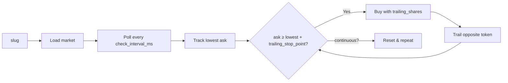

# Polymarket Sports & Politics Trailing Bot

A Rust bot for [Polymarket](https://polymarket.com) that trades **sports and politics (binary) markets** by slug using a **trailing stop** strategy only.

**Supported markets:** Binary (2-outcome) and **3-outcome** markets on Polymarket—e.g. sports (`nba-dal-orl-2026-03-05`), soccer with Draw (`aus-ade-wel-2026-03-06`), politics. You provide the market **slug**; the bot does the rest. For 3-way (e.g. Team A / Team B / Draw), the bot trails all three; it buys first an outcome under 0.50, then trails and buys one of the two remaining.

**Behavior:**
- You set a **slug** in config (e.g. the market’s event slug).
- The bot loads that single market and tracks all outcome tokens (2 or 3).
- **First leg:** It trails every outcome; it buys only one whose **price is under 0.50** when it triggers (ask ≥ lowest + trailing stop). For 3-way markets (e.g. Team A / Team B / Draw), only underdog(s) can trigger the first buy.
- **Second leg:** It trails the remaining token(s)—the opposite (binary) or the two remaining (3-way)—and buys when one triggers.
- You can run **once** (one pair of buys per market) or **continuous** (after both sides are bought, it resets and trails/buys again until the market ends).

---

## Quick start

| Binary | Description |
|--------|-------------|
| `main_sports_trailing` | Sports & politics trailing bot (default) — slug-based, trailing only |

```bash
# Build
cargo build --release

# Simulation (no real orders)
cargo run --release -- --simulation

# Live
cargo run --release -- --no-simulation
```

---

## Setup

1. **Install Rust** (if needed):
   ```bash
   curl --proto '=https' --tlsv1.2 -sSf https://sh.rustup.rs | sh
   ```

2. **Build:**
   ```bash
   cargo build --release
   ```

3. **Configure:** Create or edit `config.json` with:
   - **polymarket:** `gamma_api_url`, `clob_api_url`, `api_key`, `api_secret`, `api_passphrase`, `private_key`
   - Optional: `proxy_wallet_address`, `signature_type` (1 = POLY_PROXY, 2 = GNOSIS_SAFE)
   - **trading:**  
     - **`slug`** (required) — market slug, e.g. `"nba-dal-orl-2026-03-05"` (sports) or any binary market  
     - **`continuous`** — `true` = keep trailing and buying both sides repeatedly until market ends; `false` = buy each side once per market  
     - `trailing_stop_point` (e.g. `0.03`)  
     - `trailing_shares` (e.g. `10`)  
     - `check_interval_ms` (e.g. `1000`)

---

## Configuration

**CLI:** `--simulation` (default) · `--no-simulation` (live) · `--config <path>` (default: `config.json`)

---

### Two parts

```text
config.json
├── polymarket   →  who you are (API keys, wallet, proxy)
└── trading      →  what you trade (slug, once vs repeat, trailing)
```

---

### I want to...

**→ Run in simulation (no real money)**  
Leave API keys / `private_key` empty or as placeholders. Set **`slug`** to any market slug. Run with `--simulation`.

**→ Go live on one market**  
Fill **`polymarket`**: `api_key`, `api_secret`, `api_passphrase`, `private_key`. Set **`trading.slug`** to your market. Use `--no-simulation`.

**→ Use my Polymarket proxy or Safe**  
Add **`proxy_wallet_address`** and **`signature_type`**: `1` = proxy, `2` = Gnosis Safe.

**→ Trade once per market**  
**`continuous`**: `false` (default). One trailing cycle: buy side A, then side B, then stop.

**→ Keep trading until the market ends**  
**`continuous`**: `true`. After buying both sides, the bot resets and trails again.

**→ Trigger buys on a bigger price bounce**  
Increase **`trailing_stop_point`** (e.g. `0.05`). Buy when ask ≥ lowest + that value.

**→ Use a smaller/larger size per side**  
Set **`trailing_shares`** (e.g. `5` or `20`). Cost per buy ≈ shares × price.

---

### Full config (copy & edit)

Start from `config.example.json` or this (sample slug: `nba-dal-orl-2026-03-05`; replace with your market):

```json
{
  "polymarket": {
    "gamma_api_url": "https://gamma-api.polymarket.com",
    "clob_api_url": "https://clob.polymarket.com",
    "api_key": "",
    "api_secret": "",
    "api_passphrase": "",
    "private_key": "",
    "proxy_wallet_address": "",
    "signature_type": 2
  },
  "trading": {
    "slug": "nba-dal-orl-2026-03-05",
    "continuous": false,
    "check_interval_ms": 1000,
    "trailing_stop_point": 0.03,
    "trailing_shares": 10.0,
    "fixed_trade_amount": 1.0,
    "min_time_remaining_seconds": 30,
    "sell_price": 0.99
  }
}
```

| Part | Key | What it does |
|------|-----|----------------|
| **polymarket** | `api_key`, `api_secret`, `api_passphrase` | CLOB auth (get from Polymarket API settings). |
| | `private_key` | Wallet that signs orders; must hold USDC and be linked to Polymarket. |
| | `proxy_wallet_address` | Optional. Your Polymarket proxy/Safe address. |
| | `signature_type` | `0` EOA · `1` proxy · `2` Gnosis Safe. |
| **trading** | `slug` | **Required.** Market slug from the Polymarket URL, e.g. `nba-dal-orl-2026-03-05`. |
| | `continuous` | `false` = one cycle; `true` = repeat until market ends. |
| | `trailing_stop_point` | Buy when ask ≥ lowest + this (default `0.03`). |
| | `trailing_shares` | Shares per buy (default `10`). |
| | `check_interval_ms` | How often to poll prices (default `1000` ms). |
| | `min_time_remaining_seconds` | No buy if &lt; this many seconds left (default `30`). |

---

### How it uses the config



1. Load the market by **slug** (Gamma API).
2. Every **check_interval_ms**, fetch best ask for both tokens.
3. When **ask ≥ lowest + trailing_stop_point** (and not at a new high), buy with **trailing_shares** (or **fixed_trade_amount** fallback). Skip if time left &lt; **min_time_remaining_seconds**.
4. Same rule for the opposite token; then done, or **continuous** → reset and repeat.

---

## Notes

- The bot runs until the market ends (by end time) or you stop it (Ctrl+C).
- Simulation mode logs trades but does not place orders.

---

## Security

- Do **not** commit `config.json` with real keys or secrets.
- Prefer simulation and small sizes when testing.
- Monitor logs and balances when running in production.
